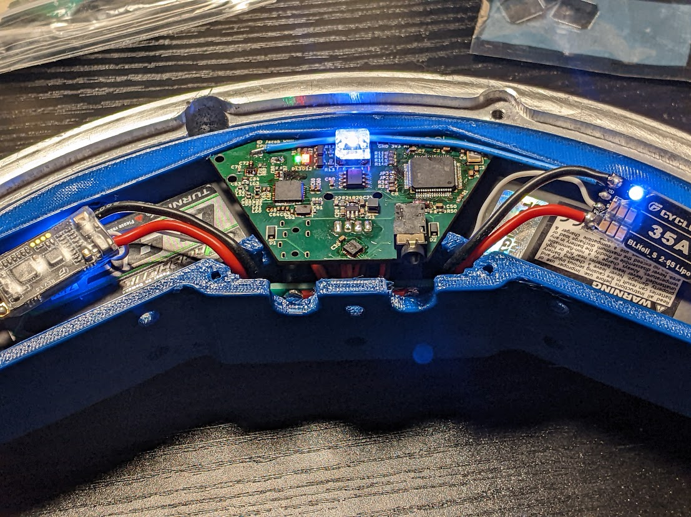
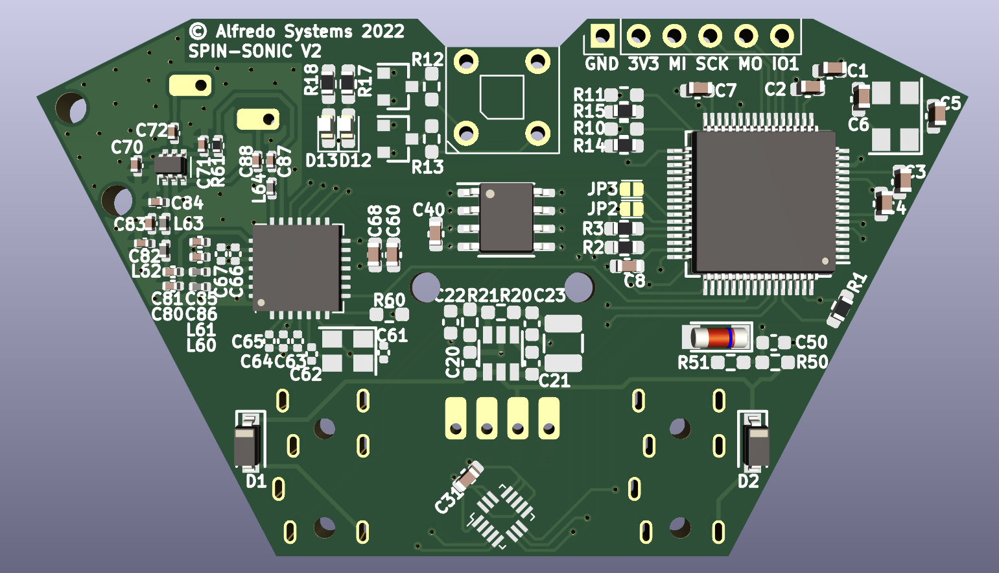

# Spin-Hardware
Control system PCB files for The Greatest Danger and The Greatest Challenge. This Repo includes KiCAD projects for two boards, "Spin-Sonic" and "Spin-Eggman". "Spin-Sonic" is the main control board with RF, sensing, and the main MCU. "Spin-Eggman" is a power distribution board used to compactly mount the main switch, bulk capacitors, and battery connectors.

> ⚠️ This design is public so the curious can reference it, I don't recommend anyone try to reproduce these boards. Learn more at the bottom of this page.

## Spin-Sonic Features
* Main MCU STM32F405RGT6 has FPU and high clock speed.
* 400g H3LIS331DL Accelerometer is rotated 45 degrees for increased precision.
* SX1276 915MHz LoRa transceiver circuit provides reliable wireless communication.
* SY8253ADC switching regulator provides up to 3A at 3.3V. Maximum input voltage of 23V. 
* TRRS jack provides swift and robust Serial Wire Debug (SWD) programming interface

## Why you shouldn't make one of these
1. The LoRa wireless system is put together pretty much from scratch. They don't really sell handheld LoRa transmitters. We made one ourselves, a process I do not recommend to anyone. We also have to make custom antenna for each board.
2. Spin-Sonic was designed to be assembled by JLCPCB, unfortunately JLC does not stock 400g accelerometers. H3LIS331DL's had to be soldered after the fact, a process that can be tedious and unreliable.
3. Using a TRRS connector (audio jack) for the programming interface does make rapid code testing easier, but we did have to make a custom programming cable which is a pain.
